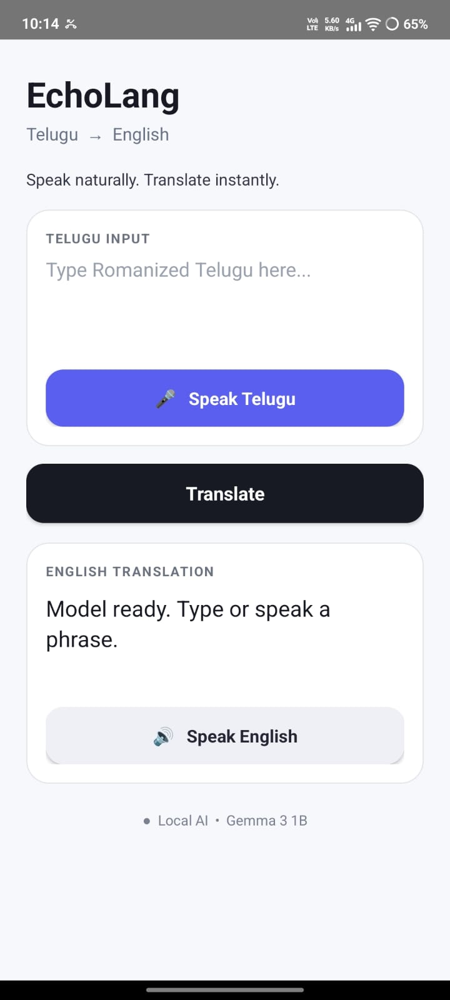

# EchoLang

### AI Voice Assistant for Local Dialects

EchoLang is an Android-based AI voice assistant designed to explore more natural interaction with users who communicate using local and regional dialects.

The current prototype combines **voice input, speech-to-text, on-device LLM inference, and translation/output on the phone**. The project is being developed with a focus on dialect-aware interaction, privacy-conscious processing, and reducing dependence on cloud-based inference.

---

## Problem

Most AI systems are primarily optimized for standardized and high-resource languages.

Users who communicate using regional dialects may experience:

* Less natural speech interaction
* Difficulty with dialect-specific vocabulary and expressions
* Problems caused by pronunciation and regional variations
* Limited support for code-mixed or informal speech

EchoLang explores a voice-first approach to make AI interaction more accessible to such users.

---

## Our Approach

The intended EchoLang interaction pipeline is:

```text
Voice Input
     ↓
Speech-to-Text
     ↓
Dialect Processing
     ↓
Local LLM
     ↓
Translation / Output
     ↓
Text-to-Speech
     ↓
Voice Response
```

### Current Prototype

The current prototype has implemented the core Android application and local LLM interaction flow.

**Currently implemented:**

* Android-based user interface
* Voice input
* Speech-to-text processing
* Local/on-device LLM integration
* Text processing and output
* Translation/output workflow

**Planned / under development:**

* Dialect-aware processing
* Text-to-speech voice response
* Expanded regional-language and dialect support
* Improved conversational interaction

The repository will be updated as these components are implemented and tested.
---

## Screenshots

### Main Screen



### Voice Input and LLM Output

